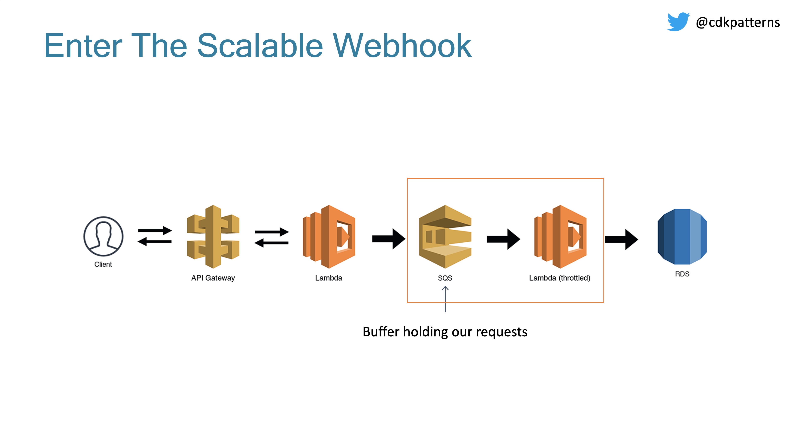
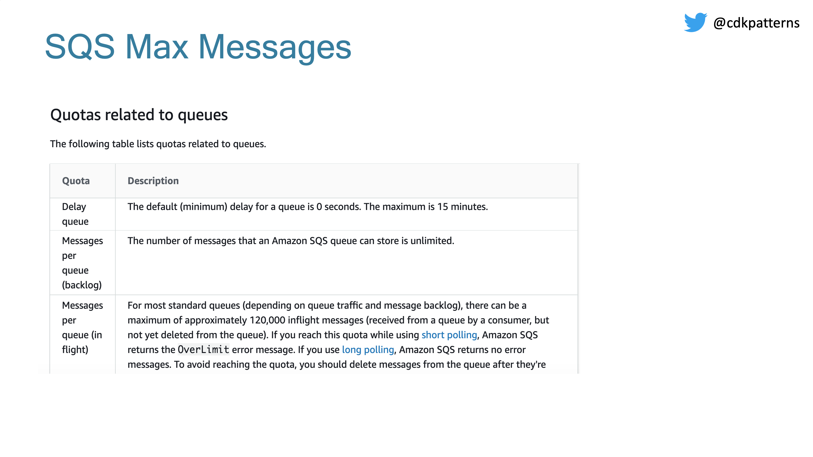
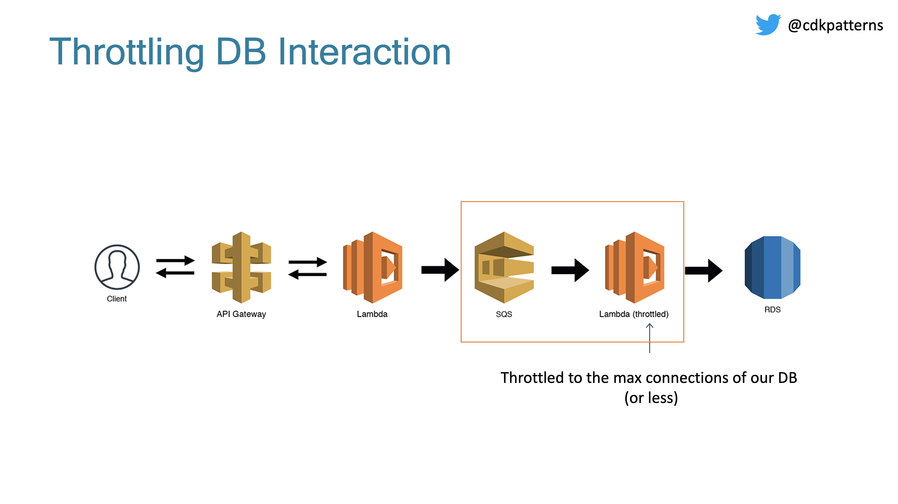
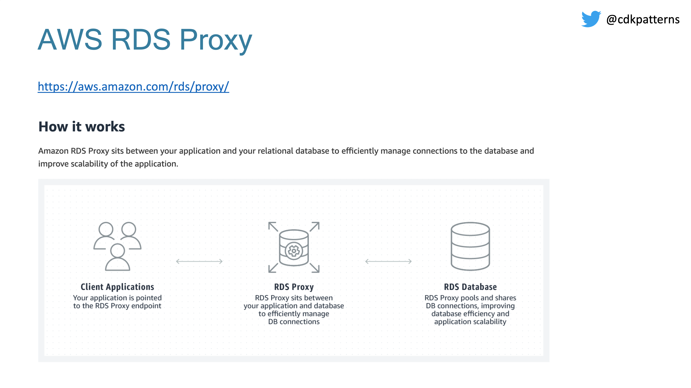

# SQS Webhook Buffer

With tests for deployed code and GroupID to ensure sequential processing where needed.

## Intro

This is an implementation of the Webhook Buffer pattern - see the end of this README for the original docs this repo was forked from which detail the pattern. 

A Webhook Buffer insets a buffer via a FIFO queue in front of an endpoint. Implemented with highly available and scalable AWS services this buffer shields you from backend scalability issues and downtime - in the even an important backend is down you don't loose any requests sent to the endpoint. 

It's a passthrough that largely passes through whatever it recieves to the backend. We have added a grouping ID to maintain ordering - i.e. if you use your order_id as the Grouping ID then all operations for a given order with remain in-order.

The endpoint immediately returns 200 for all requests so this pattern is not suitable for endpoints that need to return anything to the caller. (ed: technically - it returns as soon as the request is queued.)

It expects a grouping ID to decide which things can be run in parallel or not (think: order_id). Implementation is with API Gateway and lambdas. 

We have added integration with Sentry and DataDog.

### CDK Caveats

We used this project as a chance to experiment with cdk vs terraform. We weren't overly impressed with some of cdk's limitations:

1. This project does not have a CI/CD pipeline. Deploys are run via `npm deploy` as below - but they do run post-deploy smoke tests.
1. Unlike terraform `cdk` will not show you a plan or diff and ask if you want to apply. Unless it encounters an error it will just deploy/update immediately. Note that CDK does not deal well with drift in the deployed setup so if you tweaked things manually and came here to reset them - you might find CDK just refuses to apply when resources have changed. See Drift Detection below. CDK will rollback on any error.
1. Outputs also differ from `terraform`. They are written to `cdk.out.json` but this is local and overwritten on every deploy so `./get-outputs.ts` is provided to retrieve outputs from AWS without re-deploying environments.

## Terminology

### Faux Backend

A simple dummy backed used during development and as part of the testing rig. You can run a complete test set including failure cases if you deploy this backend.

## Setup

Assuming you have an AWS profile set up locally called `my-profile` run the following to configure your local env:

`cdk bootstrap --profile my-profile`

Configure your environment in `cdk.json`

```
...
    "<env>": {
      "awsAccount": "1234566788",
      "awsRegion": "us-east-1",

      "environment": "<env>",
      "service": "sqs-webhook-buffer",

      "forwarderArn": "arn:aws:lambda:us-east-1:11111111111:function:serverlessrepo-Datadog-Log-For-loglambdaddfunction-xxxxxxxx",
      "subdomain": "sqs",
      "domain": "mydomain.com",
      "acmCertificateArn": "arn:aws:acm:us-east-1:111111111:certificate/xxxxx-xxxx-xxxx-xxxxx-xxxxxxxxxxxxxx",
      "sentryDsn": "https://xxxxxxxxxxxxxxxxxxx@xxxxxxx.ingest.sentry.io/xxxxxxxx"
    },
...
```

Then setup the code with:

`npm run deploy --env=<env>` # NB: the `=` sign is required, a space doesn't work

This will run post deployment tests.

Check what will be modified on a deployment

`npm run diff --env=<env>`

Examine outputs for an environment with:

`aws cloudformation describe-stacks --stack-name sqs-webhook-buffer-<env> --query "Stacks[0].Outputs"`

Tear it all down with:

`npm run destroy --env=<env> # NB this will leave the DynamoDB table that needs to be manually deleted`

Run happy path tests against a deployed buffer:

`npm run test --env=dev` # See the Testing section below.

Note you may have to deploy a stack before testing it so the outputs are available in `./cdk.out.json`. If you need to do this you will see the error message:

```
Your test suite must contain at least one test.
```

Run a more complete test set including failure cases, this requires the faux backend as the backend:

`npm run test-faux-backend --env=dev`

## Useful commands

For a more detailed look at the commands check the scripts section of `package.json`.

- `npm run build` compile typescript to js
- `npm run watch` watch for changes and compile
- `npm run test` perform the jest unit tests
- `npm run deploy --env=<env>` deploy this stack to your default AWS account/region and run tests
- `npm run deploy-notest --env=<env>` same as deploy but without tests
- `npm run diff --env=<env>` compare deployed stack with current state for the env
- `npm run synth --env=<env>` emits the synthesized CloudFormation template

## Configuration

The `cdk.json` tells CDK how to execute the app and contains environment specific configuration that is accessible through the `Config` interface.

Steps for adding new parameters to the configuration

1. Add the parameter to each env in `cdk.json`
2. Declare the parameter in the `Config` interface in `lib/config.ts`
3. Assign the parameter in `bin/buffered-webhook.ts`

# TL;DR

Find the code in `lib/buffered-webhook-stack.ts` and `bin/buffered-webhook.ts`

# Caveats
## CDK vs Terraform

1. CDK has state not by directory but instead by `Stack`. In particular if you have a multi-stack CDK project and delete one of the stacks from being created in the code this will _not_ delete the stack. Within a stack behaviour appears to be similar to `tf`. however:
1. possible if objects go out of scope and get garbage collected then the resources they create do to? My faux backend lambda wasn't getting created at one point and I'm not sure what fixed it.
1. Log groups and databases don't get deleted when you destroy a stack.
   An example of a terraform version of a similar setup can be found here: https://github.com/blakegreendev/cdktf-typescript-aws-webservice/blob/master/main.ts

## Architecture / Correctness

1. How are ACKs being handled? Many event delivery systems ACK individual massages - I haven't seen that in SQS yet. Ok, I ust found it here: https://lumigo.io/blog/sqs-and-lambda-the-missing-guide-on-failure-modes/ - the polling backend does the ACKs invisibly for us, meaning it's all or nothing. Thus _it is very important we keep the batch size at 1_.
1. Lambdas triggered by SQSEventSources by default can take in up to 10 events at a time. As we execute each event in series using await (to preserve ordering) this means we can hit the 3000ms lambda timeout when the queue is backed up and all 10 event slots are filled. We have limited the number of events per invocation to 1 to prevent this.
1. Sentry isn't catching top level unhandled exceptions. Lambda adds it's own hooks and there's some complexity around getting this working without breaking some other things. (need to chain the hooks etc)
1. We are using messageId as the key to store in DynamoDB. This means if a message can't be delivered it will get retried repeatedly by the subscribe lmabda with each new attempt overwriting the previous attempt in the DB. This has the nice effect that the eventual final sucessful run might be the only one left in the DB. It also means there is only the 'latest' attempt's data stored for forensics.
1. Deploy vs testing: possibly the tests would run immediately after the deploy while requests are still being routed to an old instance of the lambda.

## Code Duplication

1. logger.ts is duplicated into the `subscribe` and `publish` lambdas, remember to update both.

## Drift

1. Drift. CloudFormation doesn't detect and fix drift like tf does: https://github.com/aws/aws-cdk/issues/1723. Remediation: https://aws.amazon.com/blogs/mt/implement-automatic-drift-remediation-for-aws-cloudformation-using-amazon-cloudwatch-and-aws-lambda/

## Dead Letter Queues

We don't use a dead letter queue, because: https://docs.aws.amazon.com/AWSSimpleQueueService/latest/SQSDeveloperGuide/sqs-dead-letter-queues.html#sqs-dead-letter-queues-when-to-use

## Errors

Note that any errors (`4xx`/`5xx`) will result in the throwing of an exception and the event being left on the SQS queue.

## Testing

We currently just test the happy path code as the error path tests would spam sentry on every deploy.

1. Tests always use the same order_id (SQS Group ID). This means if you disable `consume_bad_messages` the failure path messages will block future testing runs from passing.

_Improvements:_ We could improve the test rig by having a tag that we pass in to tell the code not to generate sentry errors for a given message. We could also pass in the body the return code we want the fauxBackend to return for us. Adding a flag when running the tests to say to test the failure paths as well.

# FAQ

<dl>
<dt><strong>If I destroy the stack and re-create it what happens with the DynamoBD database?</strong></dt>
<dd>The original database will be left untouched, but the new stack will have a new database.</dd>
<dl>

# Docs Links

1. A very interesting deep dive into lambda internals: https://www.denialof.services/lambda/ (python)

# Monitoring

See the lambdas here: https://app.datadoghq.com/functions Navigate there with Infrastructure -> Serverless. Clicking on a spacific lambda here and then on an individual invocation gives a much more readable slice of the logs that reading the entire log stream for the lambda, it's also decorated with insights added by DataDog

Also see DD's high level view here: https://www.datadoghq.com/blog/monitoring-aws-lambda-with-datadog/

To be added:

1. Errors/warning counts in the logs for both lambdas
1. SQS Queue length
1. Max age of events in the SQS queue
1. Lambda execution times
1. Idea: buffer could add a header on call to the backend (or some other marker) and we could then isolate http status codes from the backend to alert on errors there

Alerting:

1. Sentry emails
1. 500's at the API Gateway endpoint
1. Errors in the logs for both lambdas
1. Failed lambda runs
1. Max age of events in the SQS queue
1. Lambda durations approaching 10s - they will timeout there.

# DataDog Integration

The metrics are enabled within DD - install the lambda integration and with the correct IAM perms they will get picked up automatically.

For logs, as usual there are multiple competing / overlapping DataDog manual pages.

1. Instrumenting Node.js Applications
   https://docs.datadoghq.com/serverless/installation/nodejs/?tab=awscdk - pass a list of lambdas to a instantion of DataDog in your stack. Note you can set DD_CONSTRUCT_DEBUG_LOGS=true in the env to debug. This is `datadog-cdk-constructs`
1. Datadog Serverless Macro https://docs.datadoghq.com/serverless/serverless_integrations/macro/ - augment the constructor of your stack to have DD autodiscover and instrument everything it finds in the stack
1. Datadog Serverless Plugin - _this is the currently used implementation_ - https://docs.datadoghq.com/serverless/serverless_integrations/plugin/ - lower level: instrumenting from within your node code

Serverless stack has been installed using the instructions here https://docs.datadoghq.com/serverless/serverless_integrations/macro/.

```
$  aws cloudformation create-stack \
  --stack-name datadog-serverless-macro \
  --template-url https://datadog-cloudformation-template.s3.amazonaws.com/aws/serverless-macro/latest.yml \
  --capabilities CAPABILITY_AUTO_EXPAND CAPABILITY_IAM --region=us-east-1
{
    "StackId": "arn:aws:cloudformation:us-east-1:276428873250:stack/datadog-serverless-macro/923376b0-a1de-11eb-97ee-127c6c2d7f71"
}
```

Tried to use the macro path to decorate the lambdas but it gets the following error:

```
 ❌  sqs-webhook-buffer-dev failed: Error: Failed to create ChangeSet cdk-deploy-change-set on sqs-webhook-buffer-dev: FAILED, Transform 276428873250::DatadogServerless failed with: Could not execute the lambda function. Make sure you have given CloudWatch Logs permission to execute your function.
    at /usr/local/Cellar/aws-cdk/1.96.0/libexec/lib/node_modules/aws-cdk/lib/api/util/cloudformation.ts:227:11
    at processTicksAndRejections (internal/process/task_queues.js:97:5)
    at waitFor (/usr/local/Cellar/aws-cdk/1.96.0/libexec/lib/node_modules/aws-cdk/lib/api/util/cloudformation.ts:188:20)
    at Object.waitForChangeSet (/usr/local/Cellar/aws-cdk/1.96.0/libexec/lib/node_modules/aws-cdk/lib/api/util/cloudformation.ts:213:15)
    at Object.deployStack (/usr/local/Cellar/aws-cdk/1.96.0/libexec/lib/node_modules/aws-cdk/lib/api/deploy-stack.ts:263:32)
    at CdkToolkit.deploy (/usr/local/Cellar/aws-cdk/1.96.0/libexec/lib/node_modules/aws-cdk/lib/cdk-toolkit.ts:180:24)
    at initCommandLine (/usr/local/Cellar/aws-cdk/1.96.0/libexec/lib/node_modules/aws-cdk/bin/cdk.ts:208:9)
Failed to create ChangeSet cdk-deploy-change-set on sqs-webhook-buffer-dev: FAILED, Transform 276428873250::DatadogServerless failed with: Could not execute the lambda function. Make sure you have given CloudWatch Logs permission to execute your function.
```

Link here says check the region of the stack and the forwarder ARN match but that doesn't seem to be the issue: https://docs.datadoghq.com/serverless/serverless_integrations/plugin/

### Using DataDog

The `Function Name` facet is a built in one that shows the lambda name.

### Porting to Terraform

https://github.com/blakegreendev/cdktf-typescript-aws-webservice/blob/master/main.ts is an example of a lambda with DynamoDB

---

# Original Documentation - The Scalable Webhook

This is an example CDK stack to deploy The Scalable Webhook stack described by Jeremy Daly here - https://www.jeremydaly.com/serverless-microservice-patterns-for-aws/#scalablewebhook

An advanced version of this pattern was talked about by [Heitor Lessa](https://twitter.com/heitor_lessa) at re:Invent 2019 as Call me, “Maybe” (Webhook)

- [Youtube Recording](https://www.youtube.com/watch?v=9IYpGTS7Jy0)
- [Static Slides](https://d1.awsstatic.com/events/reinvent/2019/REPEAT_3_Serverless_architectural_patterns_and_best_practices_ARC307-R3.pdf)

## Desconstructing The Scalable Webhook

If you want a walkthrough of the theory, the code and finally a demo of the deployed implementation check out:

[](https://www.youtube.com/watch?v=kRI7QJfGBI8)

## High Level Description

You would use this pattern when you have a non serverless resource like an RDS DB in direct contact with a serverless resource like a lambda. You need to make
sure that your serverless resource doesn&apos;t scale up to an amount that it DOS attacks your non serverless resource.

This is done by putting a queue between them and having a lambda with a throttled concurrency policy pull items off the queue and communicate with your
serverless resource at a rate it can handle.


<strong>NOTE:</strong> For this pattern in the cdk deployable construct I have swapped RDS for DynamoDB. <br /><br />Why? Because it is significantly cheaper/faster for developers to deploy and maintain, I also don't think we lose the essence of the pattern with this swap given we still do the pub/sub deduplication via SQS/Lambda and throttle the subscription lambda. RDS also introduces extra complexity in that it needs to be deployed in a VPC. I am slightly worried developers would get distracted by the extra RDS logic when the main point is the pattern. A real life implementation of this pattern could use RDS MySQL or it could be a call to an on-prem mainframe, the main purpose of the pattern is the throttling to not overload the scale-limited resource.

## Pattern Background

When people move to the cloud (especially serverless) they tend to think that this means their applications are now infinitely scalable:


For the right reasons this just isn't true. If any one person's resources were infinitely scalable then any one person could consume the whole of AWS no matter how scalable the platform.


- [View API Gateway limits](https://docs.aws.amazon.com/apigateway/latest/developerguide/api-gateway-request-throttling.html)
- [View Lambda limits](https://docs.aws.amazon.com/lambda/latest/dg/gettingstarted-limits.html)
- [View DynamoDB Limits](https://docs.aws.amazon.com/amazondynamodb/latest/developerguide/Limits.html)

If we weren't using DynamoDB, we would need to know the max connections limit configured for our instance size:


We need to slow down the amount of direct requests to our DB somehow, that is where the scalable webhook comes in:



We can use SQS to hold all requests in a queue as soon as they come in. Again, SQS will have limits:



120,000 in flight messages with an unlimited backlog I think will be effective enough as a buffer.

[View SQS quotas](https://docs.aws.amazon.com/AWSSimpleQueueService/latest/SQSDeveloperGuide/sqs-quotas.html)

Now we have our messages in a queue but we need to subscribe to the queue and insert the records into the DB. To do this we create a throttled lambda where we set the max number of concurrent executions to whatever scale we are happy with. This should be less than the max connections on our DB and should take into account any other Lambdas running in this account.



One final improvement that we could make if implementing this in a production system is to delete the Lambda between the API Gateway and SQS. You can do a direct integration which will reduce costs and latency:


If you want an AWS managed service to try and help with this scalability problem you can check out [AWS RDS Proxy](https://aws.amazon.com/rds/proxy/) which is in preview


